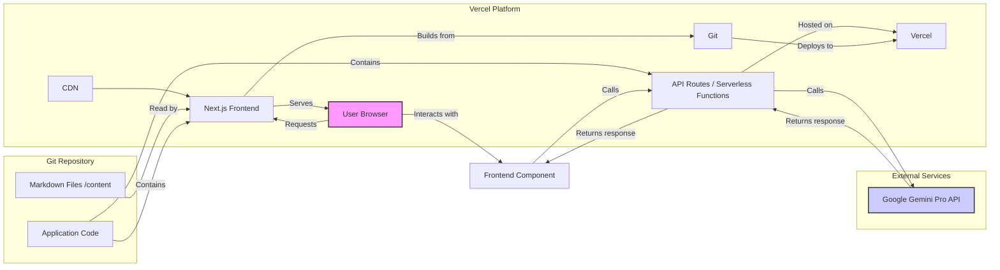

# System Patterns: VibeCodingChecklist.com

## System Architecture

*   **Overall Structure:** Next.js application deployed on Vercel, leveraging Static Site Generation (SSG) for content and Serverless Functions (via API Routes) for backend AI features.
*   **Key Components:**
    *   **Frontend:** Next.js (React) application.
    *   **Content Source:** Local Markdown files within the Git repository (`/content` directory).
    *   **Rendering Engine:** Next.js (SSG primarily, potentially SSR/ISR for specific dynamic parts).
    *   **Styling:** Tailwind CSS.
    *   **AI Integration Layer:** Next.js API Routes acting as serverless functions calling the Google Gemini Pro API.
    *   **Deployment/Hosting:** Vercel platform.

## Key Technical Decisions

*   **Framework Choice (Next.js):** Chosen for its robust features for content-driven sites (SSG, routing), React ecosystem, and seamless Vercel integration.
*   **Content Management (Markdown in Git):** Selected for simplicity, version control, and good integration with Next.js build process. Avoids external CMS dependency for V1.
*   **Styling (Tailwind CSS):** Chosen for rapid UI development and consistency, aligning well with component-based architecture.
*   **Hosting (Vercel):** Natural fit for Next.js, providing CI/CD, CDN, and serverless function hosting.
*   **AI Backend (Serverless Functions):** Leverages Vercel's infrastructure and Next.js API routes for cost-effective, scalable backend logic without managing servers.

## Design Patterns in Use

*   **Frontend Patterns:**
    *   Component-Based UI (React).
    *   Utility-First CSS (Tailwind).
    *   Static Site Generation (SSG) for content pages.
    *   File-based Routing (Next.js `pages` directory).
*   **Backend Patterns:**
    *   Serverless Functions (Next.js API Routes).
    *   API Routes for specific backend tasks (Gemini integration).
*   **Content Patterns:**
    *   Markdown with Frontmatter for structured content.
    *   Directory-based content organization (e.g., `/content/guides`, `/content/comparisons`).

## Component Relationships

*   **Data Flow (Content):** Developer pushes Markdown changes to Git -> Vercel triggers build -> Next.js reads Markdown, generates static pages -> Pages deployed to Vercel CDN -> User requests page, served by CDN.
*   **Data Flow (AI Feature - e.g., Prompt Optimizer):** User interacts with UI -> Frontend component sends request to `/api/optimize-prompt` -> Vercel executes the associated serverless function -> Function calls Gemini API -> Gemini responds -> Function processes response -> Function responds to frontend -> UI updates.
